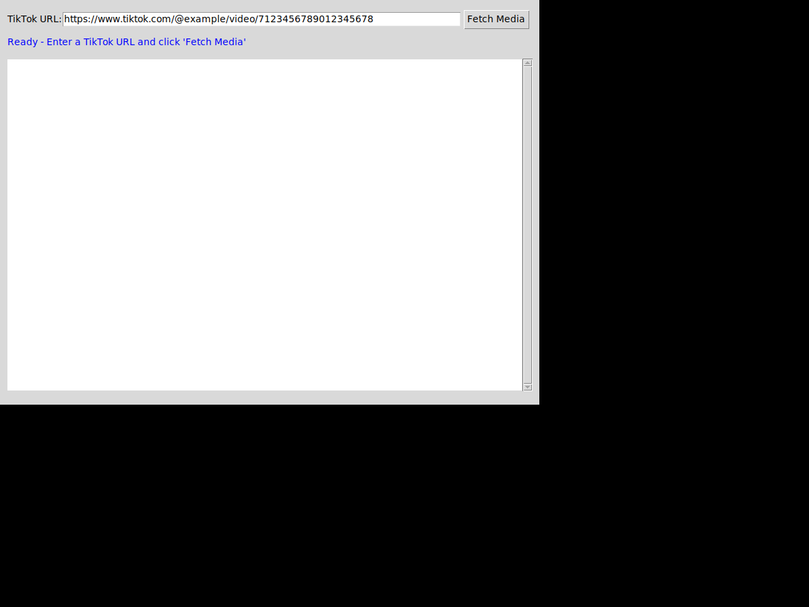
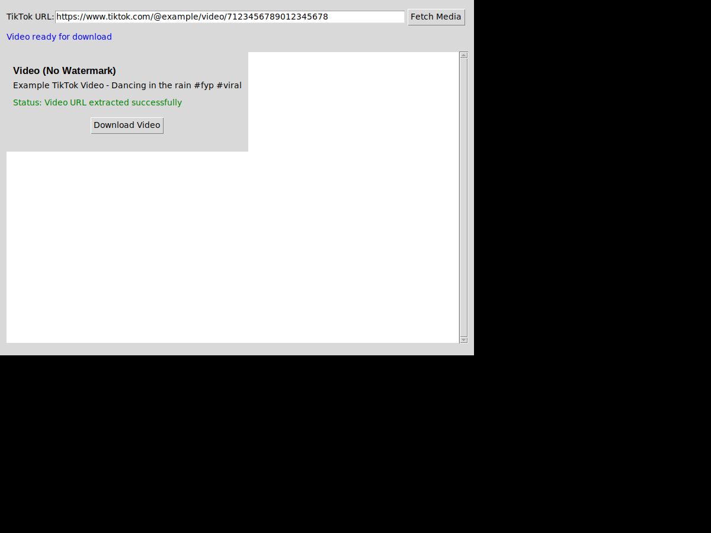
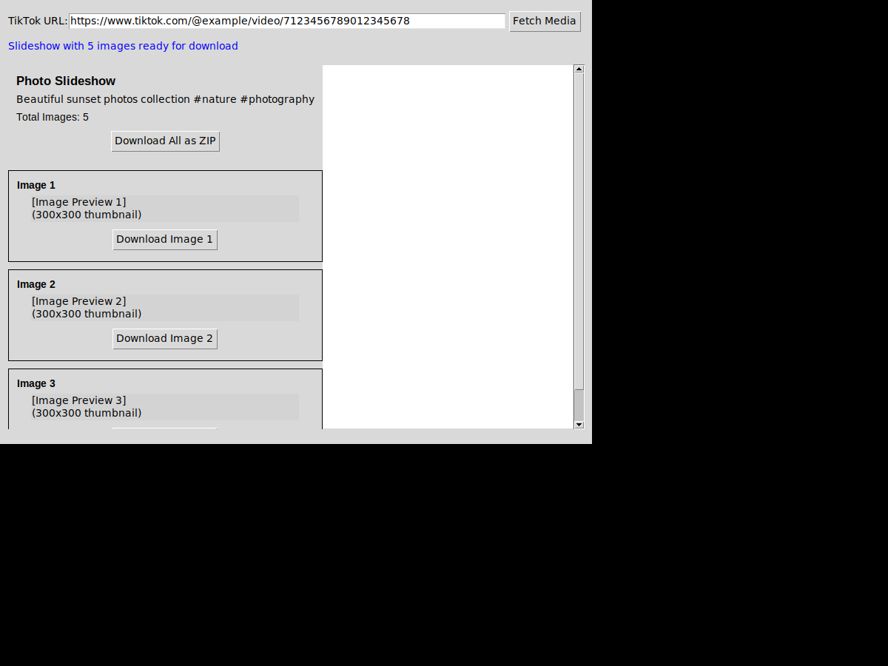

# TikTok Media Downloader

A Python GUI application to download TikTok videos (without watermark) and photo slideshows using web scraping.

## Screenshots

### Initial Interface


### Video Download Mode


### Slideshow Mode


## Features

- 🎥 Download TikTok videos without watermark
- 📸 Download photo slideshows with all images
- 🖼️ Display slideshow images in GUI with preview thumbnails
- ⬇️ Individual download buttons for each image
- 📦 Download all slideshow images as ZIP file
- ✅ Error handling and status updates
- 🌐 Web scraping based (no official API required)

## Installation

1. Clone this repository:
```bash
git clone https://github.com/Nassarz/TIKTOK.git
cd TIKTOK
```

2. Install required dependencies:
```bash
pip install -r requirements.txt
```

## Usage

Run the application:
```bash
python tiktok_downloader.py
```

### How to Use:

1. **Copy a TikTok URL** - Get the URL of any TikTok video or slideshow post
2. **Paste URL** - Paste it into the URL field in the application
3. **Fetch Media** - Click "Fetch Media" button
4. **Download**:
   - For videos: Click "Download Video" to save without watermark
   - For slideshows: 
     - View all images with previews
     - Click individual "Download Image X" buttons for specific images
     - Click "Download All as ZIP" to download all images at once

## Requirements

- Python 3.7 or higher
- tkinter (usually comes with Python)
- requests
- Pillow

## Supported URL Formats

- `https://www.tiktok.com/@username/video/1234567890`
- `https://vm.tiktok.com/XXXXXXX/`
- `https://vt.tiktok.com/XXXXXXX/`

## Error Handling

The application includes comprehensive error handling for:
- Invalid URLs
- Network errors
- Failed downloads
- Missing media data
- API failures

Status updates are shown in the GUI to keep you informed of the current operation.

## Technical Details

This application uses web scraping techniques to extract TikTok media:
1. Fetches the TikTok page HTML
2. Extracts embedded JSON data from the page
3. Parses video/image URLs from the JSON
4. Downloads media files directly (videos without watermark)
5. Fallback to third-party APIs if direct scraping fails

## Documentation

- [Detailed Usage Guide](USAGE.md) - Comprehensive guide with examples
- [Example Usage Script](example_usage.py) - Programmatic usage examples

## Disclaimer

This tool is for educational purposes only. Please respect TikTok's Terms of Service and content creators' rights. Only download content you have permission to download.

## License

MIT License
